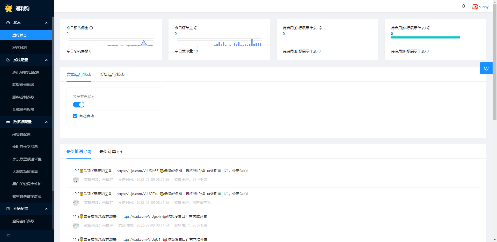

__[旺财狗官方教程网站](http://wcg.ymette.com)__
旺财狗的用途  
旺财狗是一款返利发单软件。采集商品发送到不同的群或人。  
旺财狗是一款返利自动化软件。用户发送链接返回链接，自动绑定到用户。后期提现。  
旺财狗只会自动朋友圈发单。  
旺财狗支持公众号对接。  
运行环境，Windows，Linux，Docker，基本上全构架支持。  
旺财狗支持微信框架有：木牛流马(可内网穿透和窗口发单)，西瓜框架（离线框架，主要是xyo的httpapi插件），可爱猫框架，千寻框架，e小天微信框架，酷v微信框架。  
旺财狗支持的QQ框架有：木牛流马(可内网穿透和窗口发单)，go-cqhttp，npm_onebot，oicq。  
旺财狗支持的tg框架有：木牛流马(可内网穿透和窗口发单)自研tg框架。  
也支持一些js脚本请求接口，进行发单。  
旺财狗采用了多转链接口设计，可以随时切换转链接口。  
旺财狗可以并发对接多个不同框架多个聊天账户，实现不同账户分配不同工作。  
软件是否收费：免费和付费都可以用，功能无差别。免费用户可能偶尔会有些小广告发出来。付费后可以解锁超多高级版功能。  
管理主界面：  
旺财狗目前支持：京东、淘宝、拼多多、京喜、唯品会、抖音等平台的转链、发单、返利、分佣等功能！  
支持“用户购物返利差价赚钱”、“自己的群发单赚钱”、“别人的群发单分佣赚钱”等模式。  
旺财狗内置线报云频道，海量优质线报任你推！省去了到处寻找线报群的烦恼。  
旺财狗已经初级适配公众号，实现了被动回复、自定义菜单等相关功能，同时已经支持自动结算自动提现。一定要多多支持旺财狗哦。

# 讲一下如何安装旺财狗  
旺财狗发单软件 旺财狗返利结算管理软件  
1,Windows下的安装：  
将下载下来的压缩包解压到一处，运行里面的狗头主程序即可。  
双击RebateDog.Server.exe运行  
默认端口号是15888  
想修改端口号，到目录下的Appsetting.json内修改  
访问机器IP+默认端口号15888即可访问管理。  

2，Linux的安装  
我习惯用WinSCP这个文件管理工具。  
上传到一个用户目录。建议创建一个新的目录。  
将压缩包解压。  
用ssh工具连接到linux主机，并进入旺财狗所在目录。  
后台运行旺财狗  
./start.sh  
后台停止运行  
./stop.sh  
调试运行  
./RebateDog.Server --urls="http://*:15888"  
运行起来，访问机器IP+默认端口号15888即可访问管理。  
如图：  

3，Docker版本的安装方法  
在DockerHub中的名字：zhaoyangguang/rebatedog  
1，先拉镜像  
docker pull zhaoyangguang/rebatedog:latest  
2，创建容器并运行，注意下面的$PWD/data是你的本机目录，将主机当前目录下的data目录挂载到容器的/app/data目录  
docker run -dit \  
  -v $PWD/data:/app/data  \  
  -p 15888:15888 \  
  --name rebatedog \  
  --hostname rebatedog \  
  --restart unless-stopped \  
  zhaoyangguang/rebatedog:latest  
3，再次提醒：生产用请一定要映射数据库目录出来，否则你每次都得配置，客户数据也会丢失。 Docker内的数据库目录是/app/data  
3,打开浏览器访问容器IP+上面端口15888访问即可！  

注意：所有平台旺财狗的配置文件数据文件都在运行目录下的  
/data  
文件夹里面，请保存备份好你的数据，丢失概不负责！  

其他使用文档请访问https://www.yuque.com/sunnysoft/  
